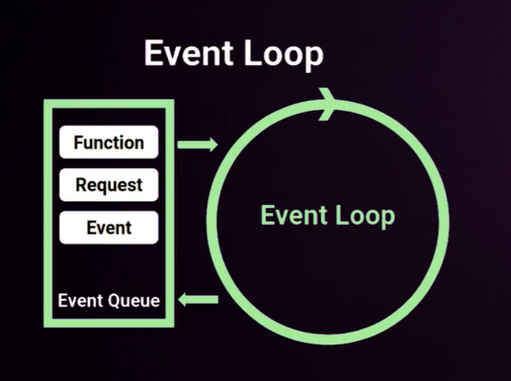
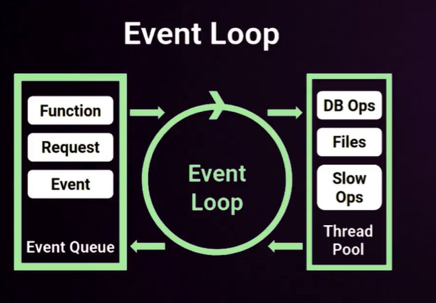
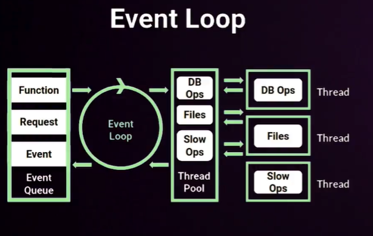

#Curso de Fundamentos de Node JS
- [- 09 Promesas](#ul-li09-promesasli-ul)
    - [01 Node: orígenes y filosofía](#01-node-or%c3%adgenes-y-filosof%c3%ada)
    - [02 EventLoop: asíncrona por diseño](#02-eventloop-as%c3%adncrona-por-dise%c3%b1o)
    - [03 Monohilo: implicaciones en diseño y seguridad](#03-monohilo-implicaciones-en-dise%c3%b1o-y-seguridad)
    - [04 Variables de entorno](#04-variables-de-entorno)
    - [05 Herramientas para ser más felices: Nodemon y PM2](#05-herramientas-para-ser-m%c3%a1s-felices-nodemon-y-pm2)
    - [07 Callbacks](#07-callbacks)
    - [08 Callback Hell: refactorizar o sufrir](#08-callback-hell-refactorizar-o-sufrir)
    - [09 Promesas](#09-promesas)
<<<<<<< HEAD
- [07 Callbacks](#07-callbacks)
- [08 Callback Hell: refactorizar o sufrir](#08-callback-hell-refactorizar-o-sufrir)
- [09 Promesas](#09-promesas)
=======
>>>>>>> 507d79c2a17f58712876dab820104e6387f3bb0d


### 01 Node: orígenes y filosofía

Node js es una formas mas rápidas de desarrollar, ejecutar y corer código en servidor de forma  escalable.

Node es un entorno de ejecución de javascript fuera del  navegador, see crea en 2009.

**Conceptos clave**

**Concurrencia**

* Mono-hilo, con entradas y salidas asíncronas
* Un proceso por cada núcleo del procesador

Node corre sobre el *motor V8* de google, escrito en c++ convierte el  código js a código maquina.

Node funciona en base a módulos, todo lo que no sea sintaxis de programación son módulos.

Muchos módulos viene por defecto en el paquete de node pero puedes crear tus propios módulos.

Node esta Orientado a eventos.

Hay un bucle de eventos que se ejecuta constantemente.

Puedes orientar tu código de forma reactiva. (Cuando suceda esto, realiza esto otro)


### 02 EventLoop: asíncrona por diseño

EventLoop: asíncrona por diseño

¿Que es el Event Loop?

Es un proceso con un bucle (como un while) que gestiona, de forma asíncrona, todos los eventos de tu aplicación.

Los eventos se gestionaran desde la cola de eventos llamada Event Queue



En caso de que no pueda resolver de forma inmediata el eventLoop enviara los procesos al Thread Pool




Quien a su vez gestiona cada uno de esos procesos abriendo un hilo como su nombre indica para cada tarea o proceso en forma paralela, cuando la tarea termina vuelve al thread pool,y después al event Queue que la devuelve al Event Loop para que e ejecute la petición o la tarea.



### 03 Monohilo: implicaciones en diseño y seguridad

La parte mas importante, al correr en un solo hilo es que debemos estar al pendiente de nuestros parámetros y nuestras funciones, ya que al momento de presentar un error se rompe el código y deja de funcionar todo lo demás.  

```
console.log('Hola mundo');

let i = 0;
setInterval(function(){
    console.log(i)
    i++

    // if (i === 5){
    //     console.log('Forzamos error')
    //     var a = 3 + z;
    // }


}, 1000);

console.log('Segunda Instrucción')
```

Iniciamos la ejecución en terminal `nodejs monohilo.js`
```
Hola mundo
Segunda Instrucción
0
1
2
```

### 04 Variables de entorno
Variables de entorno nos permite traer información desde fuera de nuestro programa y ejecutar esa información en tiempo real

Pasar directamente la variable de entorno en la consola

```
let nombre = process.env.NOMBRE ||'Sin nombre'
let web = process.env.WEB ||'no tengo web'

console.log('Hola ' + nombre);
```
Ejecutamos en terminal `NOMBRE=Rusbel nodejs entorno.js` y obtenemos el resultado al pasar directamente la variable de entorno
```
Hola Rusbel
no tengo web
```

### 05 Herramientas para ser más felices: Nodemon y PM2

**Nodemon**. Herramienta de desarrollo que cada vez que detecte cambios en el código que ejecutamos o sus dependencias vuelve a ejecutar el código de forma automática 

Instalación
```
npm install -g nodemon
```
para usarlo vamos a la terminal
```
nodemon entorno.js
```


**PM2**  Herramienta en Producción, similar a nodemon,  con opciones mucho  más avanzadas para monitorización y automatización.

Instalación
```
npm install -g pm2
```

Algunos comandos de pm2
```
// comandos disponibles básicos
pm2

// Status sencillo de lo que corre
pm2 status

// Detener un proceso por su ID
pm2 stop 0 

// Iniciar un proceso o reiniciar por su ID
pm2 start 0


// Logs de procesos corriendo
pm2 log
```

### 07 Callbacks


```
function hola(nombre, miCallback) {
    setTimeout(function () {
        console.log('Hola, ' + nombre)
        miCallback(nombre)
    }, 1000);
}

function adios(nombre, otroCallback) {
    setTimeout(function () {
        console.log('Adios, ' + nombre)
        otroCallback()
    }, 1000);
}

console.log('Iniciando proceso...')
hola('Rusbel', function (nombre) {
    adios(nombre, function () {
        console.log('Terminando proceso...')
    })
})
```
[output]
```
Iniciando proceso...
Hola, Rusbel
Adios, Rusbel
Terminando proceso...
```

### 08 Callback Hell: refactorizar o sufrir

Tomamos el código anterior y creamos una funcion intermedia para poder evitar el callback hell, esta funcion es recursiva. 

```
function hola(nombre, miCallback) {
    setTimeout(function () {
        console.log('Hola, ' + nombre)
        miCallback(nombre)
    }, 1000);
}

function hablar(callbackHablar) {
    setTimeout(function () {
        console.log('Bla bla bla bla bla...')
        callbackHablar();
    }, 1000)
}

function adios(nombre, otroCallback) {
    setTimeout(function () {
        console.log('Adios, ' + nombre)
        otroCallback()
    }, 1000);
}

// Creamos una funcion intermedia recursiva para
// evitar el callback hell
function conversation(nombre, veces, callback) {
    if (veces >= 0) {
        hablar(function () {
            conversation(nombre, --veces, callback)
        })
    } else {
        adios(nombre,callback);
    }
}

console.log('Iniciando proceso...')
hola('Rusbel', function (nombre) {
    conversation(nombre, 3, function() {
        console.log('Proceso Terminado')
    });
});
```

### 09 Promesas

```
function hola(nombre) {
    return new Promise(function (resolve, reject) {
        setTimeout(function () {
            console.log('Hola, ' + nombre)
            resolve(nombre)
        }, 1000);
    });
}

function hablar(nombre) {
    return new Promise(function (resolve, reject) {
        setTimeout(function () {
            console.log('Bla bla bla bla bla...')
            // resolve(nombre);
            reject('Hay un error');
        }, 1000)
    })
}

function adios(nombre) {
    return new Promise(function (resolve, reject) {
        setTimeout(function () {
            console.log('Adios, ' + nombre)
            resolve(nombre)
        }, 1000);
    })
}
console.log('Iniciando el proceso')
hola('Rusbel')
    .then(hablar)
    .then(hablar)
    .then(hablar)
    .then(hablar)
    .then(adios)
    .then( () => {
        console.log('Terminando el proceso')
    })
    .catch(error => {
        console.error('Ha habido un error');
        console.error(error);
    })
```